## 💫 About

I develop Full Stack software with focus on scalable backend systems, combining 4+ years of professional experience with self-taught development on personal projects in Go, Node.js, and React. I apply Clean Architecture, Test Driven Development (TDD), and SOLID principles, and integrate GenAI into my daily workflow to accelerate the software development lifecycle (SDLC).

If we have common ground or you'd like to discuss an opportunity, [let's connect on LinkedIn](https://www.linkedin.com/in/lucashoz).

## 🌐 Social networks

## 💻 Technology stack

## 📰 Latest publications

<!-- BLOG-POST-LIST:START -->
- [Race Conditions in Distributed Systems: How to Avoid Them in Go](https://medium.com/@hozlucas28/race-conditions-in-distributed-systems-6363d22b9720?source=rss-992ce3372c79------2)
- [GitHub and GitHub Actions Hardening](https://medium.com/@hozlucas28/github-and-github-actions-hardening-1e23df1311cb?source=rss-992ce3372c79------2)
- [Design Patterns and SOLID Principles: Foundations for Scalable Systems](https://medium.com/@hozlucas28/design-patterns-and-solid-principles-3aab55adbb01?source=rss-992ce3372c79------2)
- [DevContainers](https://medium.com/@hozlucas28/devcontainers-aba451bd24a0?source=rss-992ce3372c79------2)<!-- BLOG-POST-LIST:END -->

## 📊 GitHub statistics

  <picture>
    <source srcset="docs/assets/github-statistics/streak-statistics__dark.svg" media="(prefers-color-scheme: dark)"/>
    <source srcset="docs/assets/github-statistics/streak-statistics__light.svg" media="(prefers-color-scheme: light), (prefers-color-scheme: no-preference)"/>
    
  </picture>
  <picture>
    <source srcset="docs/assets/github-statistics/general-statistics__dark.svg" media="(prefers-color-scheme: dark)"/>
    <source srcset="docs/assets/github-statistics/general-statistics__light.svg" media="(prefers-color-scheme: light), (prefers-color-scheme: no-preference)"/>
    
  </picture>
  <picture>
    <source srcset="docs/assets/github-statistics/most-used-languages__dark.svg" media="(prefers-color-scheme: dark)"/>
    <source srcset="docs/assets/github-statistics/most-used-languages__light.svg" media="(prefers-color-scheme: light), (prefers-color-scheme: no-preference)"/>
    
  </picture>
  <picture>
    <source srcset="docs/assets/github-statistics/activity-graph__dark.svg" media="(prefers-color-scheme: dark)"/>
    <source srcset="docs/assets/github-statistics/activity-graph__light.svg" media="(prefers-color-scheme: light), (prefers-color-scheme: no-preference)"/>
    
  </picture>

## 🏆 GitHub trophies

<picture>
  <source srcset="docs/assets/github-statistics/trophies__dark.svg" media="(prefers-color-scheme: dark)"/>
  <source srcset="docs/assets/github-statistics/trophies__light.svg" media="(prefers-color-scheme: light), (prefers-color-scheme: no-preference)"/>
  
</picture>
